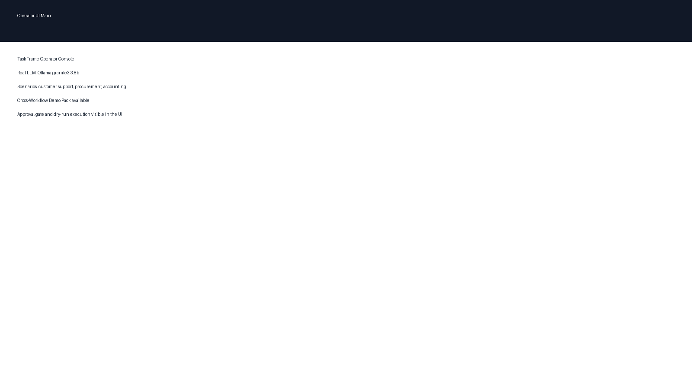
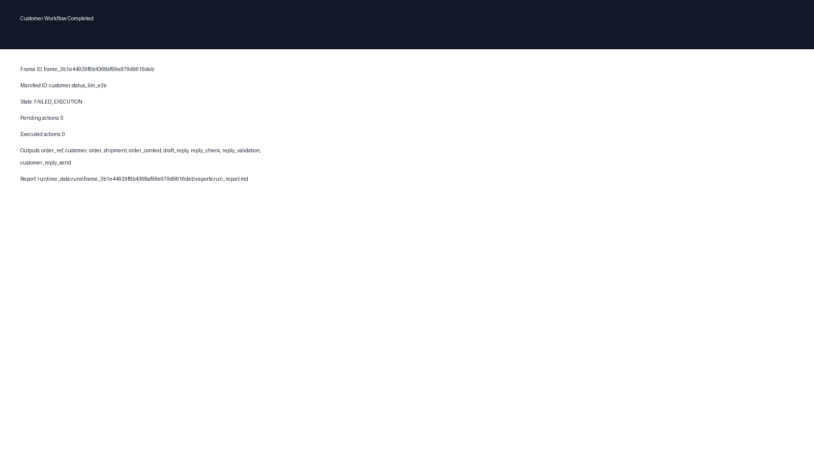
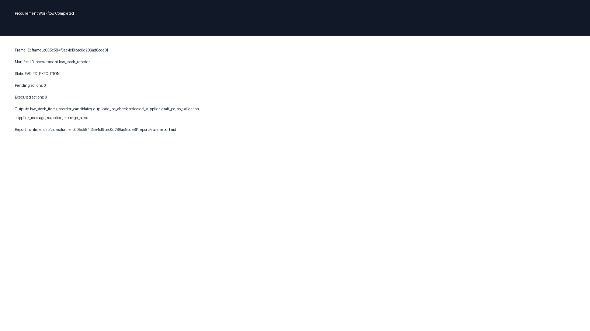
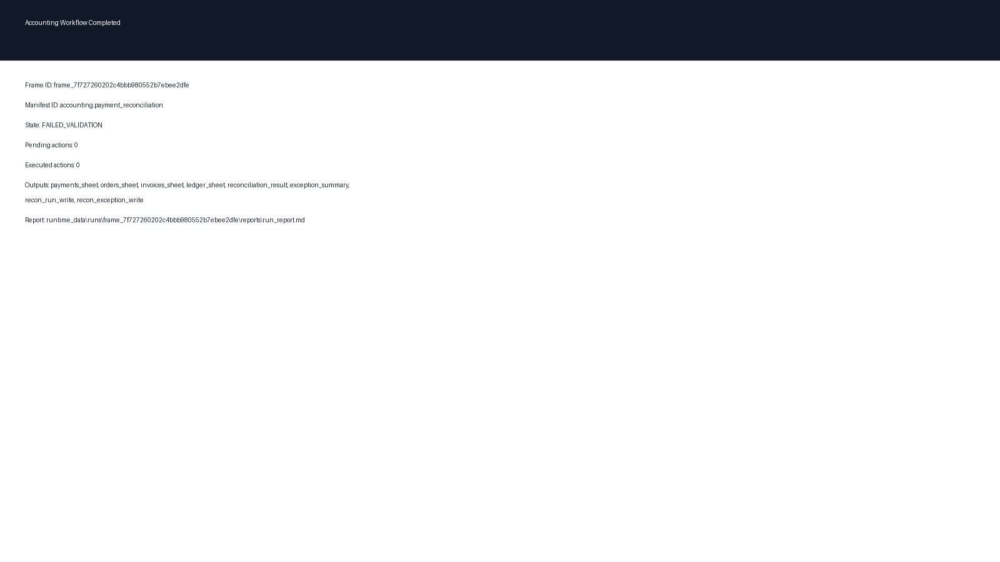
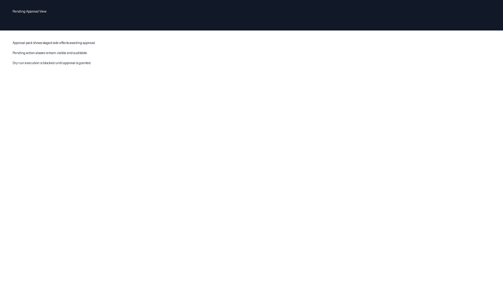
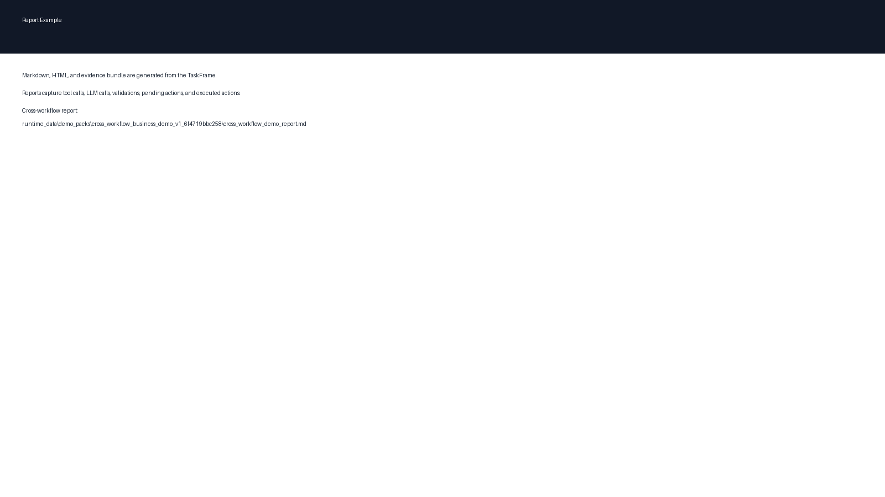
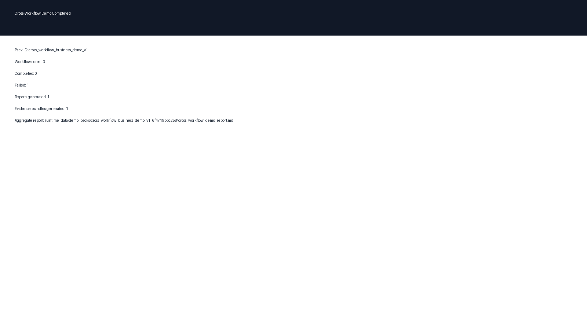
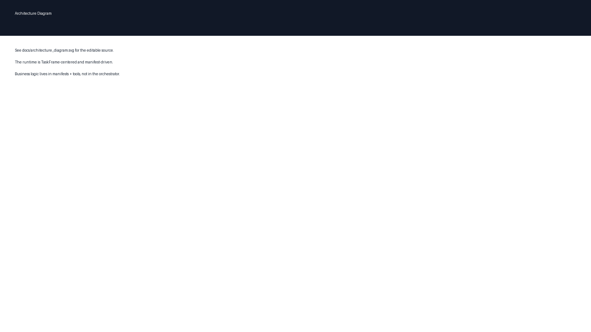

# TaskFrame Runtime
### Controlled Autonomous Business Workflow Demo

## Overview
TaskFrame Runtime is a controlled automation runtime for business workflows. It is not a free-form agent. It executes manifest-defined workflows through a TaskFrame-centered runtime, registered tools, bounded LLM calls, approval gates, dry-run side effects, and report/evidence generation.

## Why this project matters
Most agent demos are hard to control, audit, or trust. This project focuses on constrained, auditable autonomy for real business work. It uses determinism where possible, LLMs only where useful, approval before side effects, dry-run execution for safety, and durable evidence for every run.

## What It Proves
- Same runtime across multiple business workflows
- No workflow-specific orchestrator branching
- TaskFrame as the auditable execution record
- Manifest-driven business behavior
- Tools as deterministic adapters
- LLM as a bounded microtool surface
- Approval-gated side effects
- Dry-run execution and report/evidence generation

## Core Architecture
- `Operator UI`: the human control surface for launching scenarios, approval flows, and reports.
- `Event Routes`: map operator events into manifest IDs and runtime inputs.
- `Manifest`: defines the instruction contract, validations, and completion conditions.
- `TaskFrame`: the runtime case file containing state, outputs, evidence, validations, tool calls, LLM calls, pending actions, and executed actions.
- `Generic Orchestrator`: a state machine that runs manifests without business-specific branches.
- `Tool Registry`: registers deterministic adapters for customer, procurement, accounting, file, and sheet operations.
- `LLM Adapter`: provides bounded real LLM access via Ollama, with fake responses only in explicit tests.
- `Validation Layer`: checks outputs and workflow conditions deterministically.
- `Pending Actions / Approval Gate`: stages side effects for operator approval.
- `Dry-Run Executor`: executes approved actions safely without live side effects.
- `Reports / Evidence Bundle`: generates markdown, HTML, and JSON evidence artifacts from the TaskFrame.
- `Runtime Data`: stores business JSON data, run artifacts, and demo pack outputs.

## Key Workflows

### Customer Support
Customer asks about order status.
→ The system extracts the order reference.
→ It reads customer, order, shipment, and payment data.
→ It builds an order context.
→ The LLM drafts a reply.
→ Deterministic validation checks the reply against facts.
→ The customer message is staged for approval.
→ Approved execution runs in dry-run mode.
→ A report and evidence bundle are generated.

### Procurement
Low-stock inventory check.
→ Reorder candidates are filtered.
→ Duplicate open purchase orders are checked.
→ The preferred supplier is selected deterministically.
→ A draft purchase order is built.
→ The LLM drafts supplier wording only.
→ The supplier send is staged for approval.
→ Approved execution runs in dry-run mode.
→ A report and evidence bundle are generated.

### Accounting
Google Sheets accounting reconciliation.
→ Payments, orders, invoices, and ledger rows are read from Sheets.
→ Rows are normalized into typed records.
→ Reconciliation detects mismatches and duplicates.
→ The LLM drafts an exception summary only.
→ ReconRuns and ReconExceptions writes are staged for approval.
→ Approved execution runs in dry-run mode.
→ A report and evidence bundle are generated.

## Demo Highlights
The best portfolio demo is **Cross-Workflow Demo Pack v1**. It runs customer support, procurement, and accounting through the same runtime, with real LLM preflight, approval gates, dry-run execution, and per-workflow reports plus a top-level aggregate report.

## Screenshots









## How to Run
Requirements:
- Python 3.11+
- Ollama running locally
- Default model: `granite3.3:8b`
- Accounting Google Sheet config present in `config/accounting_google_sheet.json`

Start the operator UI:
```powershell
python -m src.operator_ui
```

Run the test suite:
```powershell
python -m pytest
```

Run a single scenario from code or tests:
```python
from src.operator_scenario_runner import run_scenario
result = run_scenario("customer_status_approve_execute_dry_run")
```

Run the cross-workflow demo pack:
```python
from src.operator_cross_workflow_demo import run_cross_workflow_demo_pack
result = run_cross_workflow_demo_pack()
```

Configure Ollama:
- Provider: `ollama`
- Model: `granite3.3:8b`
- Base URL: `http://127.0.0.1:11434`

Configure accounting Sheets:
- Set `spreadsheet_id` in `config/accounting_google_sheet.json`
- Ensure the tabs and ranges in that config match the target workbook

## Project Structure
- `config/`: manifests, routes, and accounting sheet config
- `runtime/`: TaskFrame runtime, tools, validations, approval logic, reports, evidence
- `src/`: operator UI, scenario runner, approval actions, demo pack runner
- `tests/`: workflow, regression, and portfolio coverage
- `docs/`: portfolio docs, architecture assets, demo script, screenshots
- `tools/`: utility scripts such as seed helpers and screenshot capture helpers
- `runtime_data/`: seeded business data and generated run artifacts

## Testing and Verification
The full pytest suite passes. Current status at the time of this portfolio pack:
- `1253 passed, 1 skipped`

The repository includes targeted workflow regression tests for customer support, procurement, accounting, and the cross-workflow demo pack.

## Key Design Principles
- TaskFrame-centered runtime
- Manifests over hardcoded orchestration
- Deterministic-first architecture
- LLM as bounded helper, not controller
- Approval before side effects
- Dry-run first
- Auditable outputs
- Lean runtime design

## Optional RPA Tools
Some browser-backed RPA tools are kept outside the default portfolio path because they depend on local browser state, external authentication, and brittle web UI behavior. These tools are useful for personal automation experiments but are not required for the core business automation runtime.

## Current Status
Architecture-complete portfolio demo:
- three workflows implemented
- cross-workflow demo available
- report/evidence generation available
- real LLM demo path available

## Future Roadmap
- Stronger controls for live side-effect execution
- Additional business workflows
- Richer approval UX
- External integrations
- Packaging and deployment improvements
